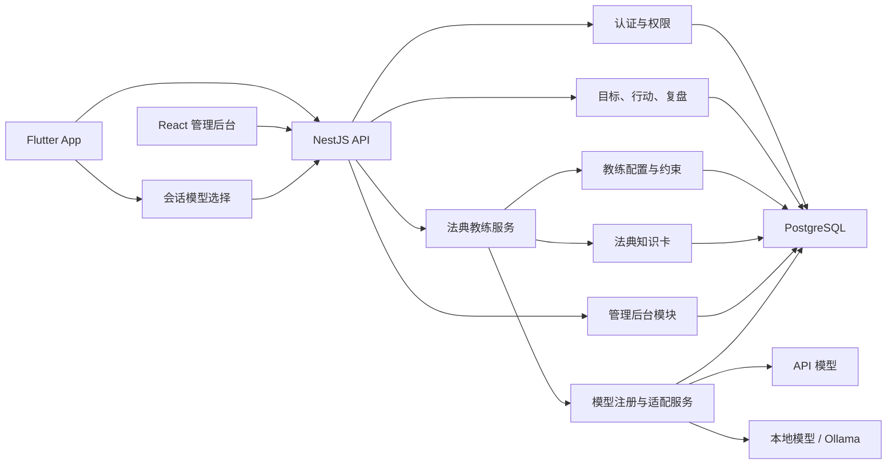
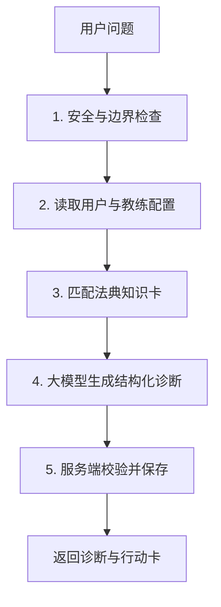

# 命运编译器：技术落地方案

> 文档状态：第三版·首版实施方案  
> 关联产品文档：[产品背景与定位](../01.product/01.产品背景与定位.md)  
> 关联计划文档：[MVP 下一步实施计划](../03.plan/01.MVP下一步实施计划.md)  
> 详细数据库设计：[数据库设计](./02.数据库设计.md)  
> 目标版本：MVP 0.1  
> 更新日期：2026-07-16

## 1. 本次调整结论

命运编译器以移动 App 作为主要产品形态，管理后台只服务运营人员和系统管理员。

调整后的技术路线为：

```text
用户端：Flutter App
管理端：React 管理后台
服务端：NestJS 单体应用
数据库：PostgreSQL
认证：NestJS 自建轻量认证，首版不接入托管认证服务
大模型：后台统一维护云端 API 模型和本地模型，客户端按会话选择
运行方式：本地与服务器均原生运行，首版不使用 Docker
```

第一版明确删除以下非必要组件：

- Next.js 用户端；
- Redis；
- BullMQ；
- 独立 Worker；
- pgvector；
- Langfuse；
- Turborepo；
- 多智能体框架；
- 独立向量数据库；
- Kubernetes；
- 托管认证服务；
- Docker 与 Docker Compose。

这些组件并不是永远不用，而是等真实业务达到相应条件后再增加。

## 2. 技术设计原则

### 2.1 先完成产品闭环

MVP 只需要可靠完成：

```text
用户提出问题
→ 法典教练理解问题
→ 匹配法典知识
→ 生成一张行动卡
→ 用户反馈完成情况
→ 系统生成下一步建议
```

任何不能直接帮助这条链路运行的基础设施，第一版都不引入。

### 2.2 单体优先

后端只部署一个 NestJS 服务，用户、对话、智能体、知识库、行动卡和后台管理都放在同一个应用中，通过模块划分代码边界。

这不是把所有代码写在一起，而是在一个部署单元中保持清晰分层。等某个模块确实出现独立扩容或独立发布需求时，再拆服务。

### 2.3 一个智能体优先

第一版只有一个系统教练智能体：法典教练。

法典匹配、用户记忆、行动卡和复盘是它调用的能力，不分别创建多个智能体。这样可以减少成本、延迟和不可控行为。

### 2.4 数据库优先

业务数据、教练配置、知识卡、使用记录和简单统计都先放在 PostgreSQL 中。只要 PostgreSQL 能解决，就不增加新的数据组件。

### 2.5 复杂度必须由真实问题触发

缓存、队列、向量数据库、工作流框架和专门的 AI 观测平台，都需要在出现明确性能或维护问题后才引入。

## 3. 简化后的总体架构



系统首版只有四个正式运行单元：

1. Flutter App；
2. React 静态管理后台；
3. NestJS API；
4. PostgreSQL。

模型服务可以是外部 API，也可以是 NestJS 所在机器或局域网可访问的本地模型服务。所有运行单元直接安装和启动，不通过容器编排。

## 4. 为什么需要这些组件

### 4.1 数据访问为什么需要 TypeORM

数据访问不是一个独立服务器，也不是额外基础设施。它只是 NestJS 中负责读写 PostgreSQL 的代码层。

如果在 Controller 和 Service 中到处直接编写 SQL，会出现：

- 字段修改后需要到处改代码；
- 用户数据归属校验容易遗漏；
- 事务难以统一处理；
- 测试时难以替换数据库；
- SQL 和业务判断混在一起。

第一版采用 TypeORM，原因是它与 NestJS 集成直接，可以处理：

- 表结构映射；
- 参数化查询；
- Migration；
- 数据库事务；
- 常规增删改查。

但不做过度抽象：

- 不为每个表设计多层接口；
- 不单独建立数据访问服务；
- 简单查询直接使用 TypeORM Repository；
- 只有复杂业务才增加领域 Repository。

结论：保留 TypeORM，但将其理解为 NestJS 的数据库工具，而不是一套复杂架构。

### 4.2 为什么首版使用自建轻量认证

如果系统只有开发者自己使用，可以先不做完整登录，使用一个固定测试用户。

一旦邀请真实用户，就必须知道：

- 当前请求属于谁；
- 某段对话和行动卡应该保存到哪个账号；
- 用户能否读取这条记录；
- 管理员和普通用户拥有哪些不同权限；
- 用户更换手机后怎样恢复历史数据。

不做身份认证会导致不同用户的数据无法可靠隔离，这是隐私问题，不只是功能问题。

首版不接入 Supabase Auth、Auth0、Clerk 等托管认证服务，身份与会话由 NestJS 和 PostgreSQL 负责。

认证分两阶段：

#### 内部原型阶段

- 不开放注册；
- 使用固定测试账号或设备测试身份；
- 目标是尽快验证 Agent 核心闭环。

#### 真实用户测试阶段

- 用户账号由管理员创建或通过一次性邀请码注册；
- 首版使用邮箱或用户名加密码登录，不做短信验证码、社交登录和开放注册；
- 密码使用 Argon2id 哈希，数据库不保存明文密码；
- NestJS 签发短期 Access Token 和可轮换的 Refresh Token；
- Refresh Token 只保存哈希值，支持单设备退出和全部设备失效；
- Flutter 使用系统安全存储保存会话；
- React 管理后台使用 HttpOnly、Secure、SameSite Cookie，并对写操作增加 CSRF 防护；
- 登录、刷新、模型调用等接口执行基于 IP 和用户的限流；
- NestJS 统一校验用户身份、角色和资源归属。

首版不实现复杂的密码找回和验证码体系。忘记密码由管理员触发重置并生成一次性临时凭据。未来需要手机号、微信、Apple 登录、邮件验证或大规模账号风控时，再评估接入托管认证或独立身份服务。

### 4.3 为什么第一版不使用缓存

缓存解决的是“数据库或接口太慢”的问题。目前数据量和用户量都不存在这个问题。

第一版直接读取 PostgreSQL：

- 教练配置数据很少；
- 法典知识卡首批只有 12～20 条；
- 单个用户近期记录数量有限；
- PostgreSQL 足以满足查询速度。

首版不使用 Redis。

只有出现以下情况才增加缓存：

- 数据库查询成为主要性能瓶颈；
- 同一份公开配置被大量重复读取；
- API 部署多个实例，需要共享限流状态；
- 实时会话状态无法仅靠数据库处理。

在此之前，可以使用进程内短时缓存，但即使缓存失效也必须能够正确读取数据库。

### 4.4 为什么第一版不使用消息队列

队列解决的是大量耗时任务不能阻塞请求、任务必须重试或多个 Worker 并行处理的问题。

MVP 的主要任务是一次用户提问和一次模型回复，可以直接在 NestJS 请求中完成并流式返回。

第一版：

- 不使用 BullMQ；
- 不部署 Redis；
- 不部署独立 Worker；
- 周报先由用户主动点击生成；
- 提醒先使用 App 本地通知；
- 知识库更新由管理员主动触发。

只有出现以下情况才增加队列：

- 每天存在大量自动周报或定时提醒；
- 知识导入和 Embedding 明显耗时；
- 模型任务需要可靠重试；
- API 因后台任务出现响应阻塞；
- 部署多个 API 实例后需要统一调度任务。

### 4.5 为什么第一版不使用 pgvector

首批法典模型只有 12～20 个。这个规模下可以使用：

```text
问题分类
→ 标签筛选
→ PostgreSQL 关键词搜索
→ 把少量候选交给大模型选择
```

没有必要先建立向量索引。

当法典模型超过约 50～100 个，或者关键词检索经常无法找到语义相关内容时，再加入 pgvector。PostgreSQL 本身可以安装 pgvector，不需要更换数据库。

### 4.6 为什么第一版不使用 Langfuse

Langfuse适合大量 Prompt、模型、工具和评测的专业追踪。首版可以先在 PostgreSQL 保存：

- 使用的模型；
- 提示词版本；
- 输入输出 Token；
- 请求耗时；
- 是否成功；
- 错误类型；
- 匹配的法典知识卡；
- 用户是否接受并完成行动卡。

当测试案例和模型版本明显增加、普通数据库记录无法快速分析时，再接入 Langfuse。

## 5. Flutter 用户 App

### 5.1 技术栈

- Flutter；
- Dart；
- Riverpod，管理应用状态；
- go_router，管理页面路由；
- Dio，调用 NestJS API 和接收流式响应；
- flutter_secure_storage，保存登录会话；
- flutter_markdown，显示智能体回复；
- App 本地通知，第一版处理行动提醒。

首版不增加本地数据库。少量非敏感设置可以使用 SharedPreferences，核心对话、行动和记忆以服务端 PostgreSQL 为准。

### 5.2 App 核心页面

第一版只做六类页面：

1. 启动与登录；
2. 初始目标设置；
3. 法典教练对话主页；
4. 诊断结果与今日行动卡；
5. 行动反馈与每日复盘；
6. 历史记录、记忆、模型和个人设置。

创建咨询会话前，客户端必须让用户选择：

- 后台已发布、允许普通用户使用的模型；
- 用户自己保存的自定义模型；
- 后台设置的默认模型，可作为无操作时的默认选项。

模型选择绑定到会话。会话创建后，后续消息默认继续使用该会话记录的模型，不随后台默认模型或模型配置的修改自动变化。用户主动切换模型时，应创建新会话，避免同一会话的上下文和输出质量无法追溯。

### 5.3 App 代码结构

```text
apps/mobile/lib/
├── app/                    # 应用入口、主题、路由
├── core/
│   ├── api/                # Dio、接口和错误处理
│   ├── auth/               # 会话与安全存储
│   ├── config/             # 环境配置
│   └── widgets/            # 全局通用组件
├── features/
│   ├── onboarding/
│   ├── coach/
│   ├── action_cards/
│   ├── reviews/
│   ├── history/
│   └── settings/
└── main.dart
```

每个 Feature 内部再按 `data`、`application`、`presentation` 分层。没有复杂业务的 Feature 不强制创建空目录。

### 5.4 流式回复

NestJS 使用 SSE 返回智能体回复，Flutter 通过 Dio 的字节流逐段更新界面。

第一版只流式显示文本，不设计复杂的工具事件时间线。诊断结束后服务端返回完整结构化结果，App 再渲染诊断卡和行动卡。

## 6. React 管理后台

### 6.1 技术栈

- React；
- Vite；
- TypeScript；
- React Router；
- TanStack Query；
- Ant Design；
- React Hook Form；
- Zod；
- ECharts，用于用户和模型使用统计。

管理后台是内部工具，不需要 SSR、SEO 和面向用户的复杂视觉效果，因此使用 React + Vite，而不是 Next.js。

### 6.2 管理后台职责

#### 法典教练配置

- 设置智能体角色和目标；
- 编辑系统提示词；
- 设置必须遵守的输出结构；
- 设置一次只能生成一个主要行动；
- 设置需要追问的条件；
- 设置禁止内容和安全边界；
- 配置行动时长、字段长度等业务约束；
- 保存草稿、发布新版本和回滚历史版本。

#### 法典知识管理

- 创建和编辑法典模型卡；
- 设置问题信号、变量、诊断问题和建议动作；
- 设置草稿、已发布和停用状态；
- 预览某个模型卡会如何参与提示词；
- 使用测试问题验证知识匹配结果。

#### 模型配置

- 创建、编辑、启用、停用和删除模型配置；
- 支持 `API` 和 `LOCAL` 两类模型；
- API 模型维护供应商、协议类型、Base URL、模型标识、API Key、超时和最大输出长度；
- 本地模型维护服务地址、模型标识和超时，首版优先兼容 Ollama 与 OpenAI-compatible 接口；
- 设置默认模型、展示名称、排序和是否允许客户端选择；
- 测试模型连接、结构化输出和流式响应；
- 查看模型使用量、成功率、耗时和估算成本；
- 为模型配置生成版本，已产生会话的旧版本只读保留。

模型 API Key 可以从后台录入，但只能通过 HTTPS 提交到 NestJS，由服务端使用主加密密钥加密后保存。主加密密钥只存在服务器环境变量中；后台接口只返回是否已配置和掩码信息，永不返回明文 Key。

用户也可以在客户端维护自己的 API-compatible 自定义模型。自定义模型归当前用户所有，API Key 只在创建或更新时由用户输入并通过 HTTPS 提交，随后由 NestJS 加密保存；Flutter 不持久化该明文 Key，查询接口也不能再次取回。管理员只能看到类型、地址、模型标识和使用统计，不能读取明文凭据。

#### 用户使用情况

- 用户数量和活跃情况；
- 每个用户的咨询次数；
- 行动卡创建和完成情况；
- Token 使用量和估算成本；
- 模型调用成功率和耗时；
- 高频问题类型；
- 用户反馈和异常 Run。

管理员默认查看统计和脱敏摘要。查看完整用户对话需要更高权限并记录审计日志，避免后台人员随意浏览私人内容。

### 6.3 管理后台页面

```text
/login
/dashboard
/coach-config
/coach-config/versions
/knowledge-cards
/knowledge-cards/:id
/model-settings
/model-settings/new
/model-settings/:id
/users
/users/:id
/agent-runs
/agent-runs/:id
/usage
```

### 6.4 React 代码结构

```text
apps/admin/src/
├── app/                    # 路由、权限和全局 Provider
├── api/                    # API Client 与类型
├── components/             # 可复用管理组件
├── features/
│   ├── dashboard/
│   ├── coach_config/
│   ├── knowledge_cards/
│   ├── model_settings/
│   ├── users/
│   ├── agent_runs/
│   └── usage/
├── layouts/
└── main.tsx
```

列表、表格和大型图表按路由懒加载。服务端数据统一交给 TanStack Query，不使用全局 Store 重复保存接口数据。

## 7. NestJS 后端

### 7.1 技术栈

- NestJS；
- TypeScript；
- PostgreSQL；
- TypeORM；
- class-validator，校验 HTTP DTO；
- Zod，校验大模型结构化输出；
- Swagger/OpenAPI；
- Pino，结构化日志；
- Argon2，处理密码哈希；
- JWT 与 Refresh Token，会话认证；
- Node.js Crypto，模型凭据加密；
- OpenAI-compatible 适配器，接入多数 API 与本地模型；
- 必要时为非兼容供应商增加独立适配器。

### 7.2 后端模块

```text
AuthModule             # 登录、身份和角色
UsersModule            # 用户资料和统计
GoalsModule            # 目标和当前阶段
ConversationsModule    # 会话和消息
CoachConfigModule      # 法典教练配置与版本
KnowledgeModule        # 法典知识卡和检索
AgentModule            # 智能体执行流程
ActionCardsModule      # 行动卡
ReviewsModule          # 执行反馈和复盘
ModelModule            # 后台模型、自定义模型、版本与调用适配
UsageModule            # Token、耗时和调用统计
AdminModule            # 管理员查询与操作
```

这些模块都运行在同一个 NestJS 进程中，不是微服务。

### 7.3 后端分层

```text
Controller
→ 接收请求、认证、DTO 校验

Service
→ 业务规则、事务和权限判断

TypeORM Repository
→ PostgreSQL 数据读写
```

Agent 工具只能调用 Service，不能直接执行任意 SQL。

## 8. 法典教练配置

管理后台需要能够控制法典教练，但不能让一次错误编辑立即影响所有用户。

### 8.1 配置内容

一份教练配置包括：

```text
名称
版本号
角色定义
产品目标
系统提示词
对话原则
追问规则
行动卡规则
禁止事项
安全边界
输出格式
默认模型
状态：草稿 / 已发布 / 已停用
```

这里的默认模型只用于新会话的默认选项。真正执行时优先读取会话绑定的模型版本，不允许教练配置发布后静默替换已有会话的模型。

### 8.2 发布机制

```text
管理员编辑草稿
→ 使用测试问题预览
→ 保存测试结果
→ 发布新版本
→ 新请求使用新版本
→ 旧 Agent Run 保留原版本号
→ 出现问题时回滚旧版本
```

系统任何时候只能有一个已发布的主配置。每次 Agent Run 必须记录使用的 `coach_config_version`。

## 9. Agent 执行流程

第一版使用程序控制的五步流程，不引入 Agent 框架：



每次执行限制：

- 最多进行一次核心模型生成；
- Schema 错误时最多修复一次；
- 最多匹配三个法典模型；
- 最多生成一张主要行动卡；
- 信息不足时最多提出三个关键问题；
- 高风险问题不生成行动卡；
- 请求和模型调用都设置超时；
- 每次执行记录会话选择的模型、模型配置版本、耗时、Token、教练配置版本和知识卡 ID。

### 9.1 核心输出结构

```json
{
  "problemSummary": "用户已经长期准备，但没有产生真实发布行为",
  "needsClarification": false,
  "clarificationQuestions": [],
  "riskLevel": "normal",
  "primaryBottleneck": "execution",
  "matchedModels": [
    {
      "id": "focus",
      "name": "专注力",
      "reason": "用户持续研究，但没有可见交付"
    }
  ],
  "diagnosis": "当前不缺少知识，主要问题是没有完成第一次真实交付。",
  "action": {
    "title": "录制并保存第一条测试视频",
    "durationMinutes": 45,
    "deliverable": "一段可以完整播放的60秒视频",
    "completionCriteria": [
      "视频已经保存在相册中"
    ],
    "stopDoing": [
      "继续研究设备",
      "重新修改账号定位"
    ]
  },
  "reviewQuestion": "真正阻碍你开始录制的动作是什么？"
}
```

服务端用 Zod 校验结构，并额外检查高风险状态、行动数量和字段长度。

## 10. 法典知识匹配

### 10.1 首版不做向量数据库

法典知识卡保存在 PostgreSQL，每张卡包含：

- 名称；
- 分类；
- 问题信号；
- 关联变量；
- 诊断问题；
- 可选行动；
- 禁止事项；
- 复盘问题；
- 版本和发布状态。

首版检索流程：

```text
大模型或规则提取问题分类与关键词
→ PostgreSQL 按分类、标签和关键词筛选
→ 返回最多 5 个候选
→ 核心模型选择最相关的 1～3 个
```

管理后台提供测试问题，管理员可以看到匹配了哪些知识卡并人工修正标签。

### 10.2 何时加入 pgvector

满足任一条件时再加入：

- 已发布知识卡超过 50～100 个；
- 关键词检索 Top 5 命中率持续低于目标；
- 用户大量使用同义表达，标签维护成本明显上升；
- 评测证明向量检索能显著提高匹配准确率。

## 11. 模型管理与会话选择

### 11.1 统一模型注册表

首版支持维护多个模型，不把供应商和模型名称写死在代码中。后台模型与用户自定义模型统一进入模型注册表，但使用不同的所有权和可见性规则。

模型记录至少包含：

```text
模型 ID
配置版本
所有者：system / user
类型：api / local
协议：openai-compatible / ollama / provider-specific
展示名称
Base URL
模型标识
加密后的 API Key（可为空）
超时和最大输出长度
是否支持流式输出
是否支持结构化输出
状态：草稿 / 已发布 / 已停用
是否允许客户端选择
```

NestJS 内部定义统一接口：

```typescript
interface LlmAdapter {
  generateDiagnosis(
    model: ResolvedModelConfig,
    input: DiagnosisInput,
  ): Promise<DiagnosisResult>

  testConnection(model: ResolvedModelConfig): Promise<ModelHealthResult>
}
```

首版优先完成 OpenAI-compatible 和 Ollama 两个适配器。只有确实无法使用兼容协议的供应商，才增加专用适配器。

模型地址、模型标识、超时和能力信息进入版本快照；API Key 作为独立凭据只保留当前加密值，不复制到历史快照。会话固定的是模型元数据版本，管理员轮换 API Key 属于安全操作，会立即供该模型的后续调用使用，但不会改变历史记录显示的模型、地址和参数。

### 11.2 后台维护模型

管理员可以维护云端 API 模型和服务端可访问的本地模型：

- API 模型适合正式用户和公网环境；
- 本地模型适合本机开发、内网部署和隐私实验；
- 本地模型地址必须从 NestJS 所在环境可访问，客户端设备上的 `localhost` 不代表服务器；
- 后台发布模型新版本后，只影响新建会话；
- 只有从未发布且未被会话引用的草稿模型可以物理删除，其他模型只能停用；
- 停用模型后禁止创建新会话，但历史会话和 Agent Run 仍保留原配置快照；
- 已停用模型的历史会话再次发送消息时，要求用户选择可用模型并创建新会话。

### 11.3 客户端选择与自定义模型

创建会话时，Flutter 获取当前用户可用的模型列表。用户可以：

1. 选择后台发布的模型；
2. 选择自己已保存的自定义模型；
3. 新建一个自定义 API-compatible 模型后再开始咨询。

服务端创建会话时保存：

```text
model_source：managed / custom
model_config_id
model_config_version
model_snapshot：展示名称、协议、Base URL、模型标识和能力，不含 API Key
```

每条 `agent_run` 再记录实际调用的模型版本和结果。这样即使后台修改默认模型、地址或参数，也能准确知道历史会话使用了什么模型。

首版不允许在一个会话中无痕切换模型。用户需要切换时，以当前会话摘要作为可选上下文创建新会话，并重新选择模型。

### 11.4 模型凭据安全

- 系统级主加密密钥只保存在 NestJS 运行环境变量中，并带有密钥版本号以支持后续轮换；
- 数据库只保存使用 AES-256-GCM 加密后的模型 API Key、随机 IV、认证标签和密钥版本；
- API Key 的录入、更新和临时使用必须经过 HTTPS；
- React 和 Flutter 不能通过查询接口取回已保存的明文 Key；
- 测试连接接口不回显 Key、供应商原始错误体或敏感请求头；
- Base URL 使用协议和地址白名单校验，并阻止访问云元数据地址、回环地址等非预期目标，降低 SSRF 风险；
- 只有明确标记为本地模型的系统配置可以访问管理员允许的内网地址；
- 所有模型调用设置超时、最大输出长度、用户级限流和并发限制；
- 日志、错误响应、会话快照和 Agent Run 都不保存 API Key；
- 删除自定义模型时同步删除加密凭据；历史记录只保留不含密钥的模型快照。

## 12. 数据库设计

第一版控制在以下核心表：

| 表 | 用途 |
| --- | --- |
| `users` | 用户、管理员角色和状态 |
| `auth_invitations` | 一次性邀请码、有效期和使用状态 |
| `auth_sessions` | Refresh Token 哈希、设备和失效状态 |
| `user_profiles` | 用户资料、时区和偏好 |
| `goals` | 用户目标和当前阶段 |
| `coach_configs` | 法典教练配置与版本 |
| `knowledge_cards` | 法典知识卡 |
| `model_configs` | 后台模型与用户自定义模型的当前配置 |
| `model_config_versions` | 不含明文密钥的模型配置版本与历史快照 |
| `model_credentials` | AES-256-GCM 加密后的模型凭据 |
| `conversations` | 对话会话及绑定的模型版本 |
| `messages` | 用户和智能体消息 |
| `agent_runs` | 实际模型版本、耗时、Token、配置和状态 |
| `action_cards` | 主要行动和完成标准 |
| `execution_records` | 完成、部分完成和未完成反馈 |
| `memories` | 用户确认或系统提取的长期记忆 |
| `reviews` | 每日和阶段复盘 |

暂不创建：

- 缓存表；
- 队列表；
- Embedding 表；
- 复杂审计事件仓库；
- 数据仓库；
- 单独统计数据库。

管理后台统计直接使用 PostgreSQL 聚合查询。数据量增长后再考虑每日汇总表。

## 13. 核心 API（以代码生成的 OpenAPI 为准）

以下列表只用于说明首版资源范围，不作为手写接口契约。正式接口契约由 NestJS 的 DTO、`class-validator`、Swagger 装饰器、Controller 和 E2E 测试共同定义。

NestJS 运行时提供 Swagger UI 和 OpenAPI JSON，例如：

```text
GET /api/docs
GET /api/docs-json
```

OpenAPI JSON 可以导入 Apifox，用于调试、Mock、环境变量和接口测试。OpenAI SDK 只负责调用大模型，不负责本系统的业务 API。

### 13.1 Flutter API

```text
POST   /api/v1/auth/login
POST   /api/v1/auth/register               # 必须提交有效邀请码
POST   /api/v1/auth/refresh
POST   /api/v1/auth/logout
POST   /api/v1/auth/change-password
GET    /api/v1/me
PATCH  /api/v1/me

GET    /api/v1/goals
POST   /api/v1/goals
PATCH  /api/v1/goals/:id

GET    /api/v1/models
GET    /api/v1/custom-models
POST   /api/v1/custom-models
PATCH  /api/v1/custom-models/:id
DELETE /api/v1/custom-models/:id
POST   /api/v1/custom-models/:id/test

POST   /api/v1/conversations               # 必须提交 modelConfigId
GET    /api/v1/conversations
GET    /api/v1/conversations/:id/messages
POST   /api/v1/conversations/:id/messages

GET    /api/v1/action-cards
GET    /api/v1/action-cards/:id
POST   /api/v1/action-cards/:id/execution-records

GET    /api/v1/reviews
POST   /api/v1/reviews

GET    /api/v1/memories
PATCH  /api/v1/memories/:id
DELETE /api/v1/memories/:id
```

### 13.2 管理后台 API

```text
GET    /api/v1/admin/dashboard

GET    /api/v1/admin/coach-configs
POST   /api/v1/admin/coach-configs
PATCH  /api/v1/admin/coach-configs/:id
POST   /api/v1/admin/coach-configs/:id/publish
POST   /api/v1/admin/coach-configs/:id/test

GET    /api/v1/admin/knowledge-cards
POST   /api/v1/admin/knowledge-cards
PATCH  /api/v1/admin/knowledge-cards/:id
POST   /api/v1/admin/knowledge-cards/:id/publish

GET    /api/v1/admin/users
POST   /api/v1/admin/users
GET    /api/v1/admin/users/:id
POST   /api/v1/admin/users/:id/reset-password
POST   /api/v1/admin/invitations
GET    /api/v1/admin/agent-runs
GET    /api/v1/admin/agent-runs/:id
GET    /api/v1/admin/usage

GET    /api/v1/admin/models
POST   /api/v1/admin/models
GET    /api/v1/admin/models/:id
PATCH  /api/v1/admin/models/:id
DELETE /api/v1/admin/models/:id
POST   /api/v1/admin/models/:id/publish
POST   /api/v1/admin/models/:id/test
POST   /api/v1/admin/models/:id/set-default
```

所有管理接口必须验证管理员角色。普通用户接口必须校验资源归属，不能仅因为知道 ID 就读取其他人的数据。

## 14. 身份、权限和隐私

### 14.1 角色

首版只保留两个角色：

- `user`：使用 Flutter App，只能访问自己的数据；
- `admin`：使用 React 后台，管理教练配置和查看运营数据。

不提前设计复杂权限树。

### 14.2 会话存储

- NestJS 自行校验账号密码并签发 Access Token 与 Refresh Token，不依赖托管认证服务；
- 密码使用 Argon2id 哈希，登录错误不区分“账号不存在”和“密码错误”；
- Flutter：Token 保存到 Keychain/Keystore 对应的安全存储；
- React 后台：通过 HttpOnly、Secure、SameSite Cookie 保存管理员会话，状态修改接口校验 CSRF Token；
- Access Token 使用较短有效期，过期后通过受控刷新接口更新；
- Refresh Token 每次使用后轮换，服务端只保存其哈希和设备信息；
- 退出时删除客户端会话并使当前 Refresh Token 失效；修改密码或管理员禁用账号时可使全部会话失效；
- 登录、刷新和密码修改接口必须限流并记录不含密码、Token 的安全事件。

### 14.3 用户数据

- 所有用户业务表都关联 `user_id`；
- Service 查询必须同时带上当前用户 ID；
- 管理员查看完整对话需要更高风险提示和审计记录；
- 用户可以删除单条记忆和历史会话；
- 日志不默认输出完整聊天正文；
- 高风险内容只保存产品运行所需信息。

## 15. 统计与系统观测

第一版不接入独立数据平台，直接使用 `agent_runs` 和业务表统计：

- 每日活跃用户；
- 新增用户；
- 咨询次数；
- 成功和失败的 Agent Run；
- 平均响应时间；
- 输入输出 Token；
- 估算模型成本；
- 行动卡创建率；
- 行动完成率；
- 高频问题类型；
- 使用的模型和模型配置版本；
- 使用的教练配置版本；
- 使用的知识卡。

NestJS 使用 Pino 输出结构化日志。Beta 阶段可以接入 Sentry 捕获异常；当 Prompt 版本和模型评测明显复杂后再接入 Langfuse。

## 16. 测试方案

### 16.1 后端测试

- 法典教练配置发布与回滚；
- 用户注册邀请、登录、Token 刷新、轮换和退出；
- 密码哈希、管理员重置密码和会话全部失效；
- 用户和管理员权限；
- 用户数据归属；
- 知识卡匹配；
- Agent 输出 Schema；
- 高风险问题分支；
- 一次只创建一张主要行动卡；
- 后台模型 CRUD、发布、停用和连接测试；
- 用户自定义模型所有权和密钥不可回读；
- 会话绑定模型版本且后台修改不影响历史会话；
- 自定义 Base URL 的 SSRF 防护；
- 模型超时和错误处理；
- Token 与使用量记录。

### 16.2 Flutter 测试

- 登录和会话恢复；
- 会话创建前选择后台模型或自定义模型；
- 历史会话展示实际使用的模型；
- 提问与流式回复；
- 诊断卡和行动卡展示；
- 行动反馈；
- 网络中断和重试；
- 安全存储；
- 关键页面 Widget 测试。

### 16.3 React 后台测试

- 管理员路由保护；
- 教练配置编辑和发布；
- 知识卡管理；
- API 模型和本地模型维护、发布与连接测试；
- 模型密钥录入后不可回显；
- 用户统计筛选；
- 敏感对话查看权限。

### 16.4 Agent 评测

首版准备至少 50 条真实测试问题，每条标注：

- 预期问题类型；
- 是否需要追问；
- 可接受的法典知识卡；
- 是否属于高风险；
- 合格行动必须满足什么；
- 禁止出现什么建议。

每次修改教练配置或核心 Prompt 后执行评测，防止后台一次配置修改导致整体质量下降。

## 17. 项目目录

```text
ai_destiny_compiler/
├── apps/
│   ├── mobile/                 # Flutter App
│   ├── admin/                  # React + Vite 管理后台
│   └── api/                    # NestJS 单体后端
├── knowledge/
│   ├── source/                 # 原始法典模型卡
│   └── fixtures/               # 知识匹配测试问题
├── evals/
│   └── datasets/               # Agent 评测数据
├── docs/
│   ├── 01.product/
│   └── 02.technology/
├── scripts/                    # 本地初始化、迁移和启动脚本
└── README.md
```

Flutter、React 和 NestJS 保持各自独立的依赖文件，不强行用同一个构建工具管理三种工程。

## 18. 本地开发

### 18.1 必需软件

- Flutter SDK；
- Xcode，用于 iOS 构建；
- Android Studio，用于 Android SDK 和模拟器；
- Node.js；
- pnpm；
- PostgreSQL，本机安装或连接独立开发数据库；
- Ollama，可选但建议；
- PostgreSQL 客户端，可选。

### 18.2 本地运行

```text
Flutter App       → iOS Simulator / Android Emulator
React Admin       → Vite Dev Server
NestJS API        → Node.js
PostgreSQL        → macOS / Linux 原生服务或远程开发库
Ollama            → macOS / Linux 原生服务，可选
```

首版不提供 Dockerfile 和 Docker Compose。开发者直接安装 PostgreSQL，使用 TypeORM Migration 初始化数据库；Node.js 服务使用 `pnpm` 启动，Ollama 按需原生启动。后续团队协作或部署标准化确有需要时，再补充容器方案。

## 19. 部署方案

### 19.1 内部测试

```text
Flutter App       → TestFlight / Android 内测包
React Admin       → 静态网站托管
NestJS API        → 一台云服务器或托管 Node 平台
PostgreSQL        → Supabase 或托管 PostgreSQL
模型              → 后台维护的 API 模型或服务器可访问的本地模型
```

这里的 Supabase 仅可作为 PostgreSQL 数据库托管选项，不使用 Supabase Auth。NestJS 以原生 Node.js 进程运行，可使用 systemd 或 PM2 管理，不构建 Docker 镜像。

### 19.2 国内公开测试

```text
Flutter App       → iOS TestFlight / App Store / Android 分发
React Admin       → 阿里云 OSS、腾讯云 COS 或服务器静态站点
NestJS API        → 阿里云或腾讯云服务器
PostgreSQL        → 云数据库 PostgreSQL
模型              → 后台维护的国内 API 模型或自建本地模型服务
```

只部署一个原生 NestJS 进程即可开始测试。确认并发和稳定性需求后再做多实例、负载均衡、共享缓存或容器化。

## 20. 分阶段开发计划

### 阶段 0：内部 Agent 原型

- NestJS 和 PostgreSQL；
- 固定测试用户；
- 教练配置表；
- 首批 12 个法典知识卡；
- 后台模型注册表；
- 至少一个 API 模型和一个可选 Ollama 本地模型；
- 问题到结构化诊断；
- Agent Run 和 Token 记录。

完成标准：通过 API 能稳定生成符合约束的诊断和行动卡。

### 阶段 1：Flutter 核心 App

- Flutter 项目结构；
- 初始目标；
- 新建会话时选择后台模型；
- 对话和流式回复；
- 诊断与行动卡；
- 行动反馈；
- 历史记录。

完成标准：测试用户能在手机上完成一次完整行动闭环。

### 阶段 2：React 管理后台

- 管理员登录；
- 教练配置版本；
- 法典知识卡管理；
- API 与本地模型维护、测试、发布和停用；
- 用户和使用情况；
- Agent Run 查询。

完成标准：不修改代码也能安全调整教练约束、法典内容和可用模型。

### 阶段 3：公开 MVP

- NestJS 自建用户认证；
- 邀请注册和管理员重置密码；
- 用户数据隔离；
- 客户端选择后台模型；
- 用户自定义 API-compatible 模型；
- 会话固化模型版本；
- 记忆查看与删除；
- App 本地提醒；
- Agent 评测集；
- 异常监控；
- TestFlight 和 Android 内测。

完成标准：可以邀请 20～30 名真实用户持续测试。

## 21. 什么时候再增加复杂组件

| 组件 | 首版 | 引入条件 |
| --- | --- | --- |
| Redis | 不使用 | 多实例共享限流、热点缓存或实时状态 |
| BullMQ | 不使用 | 自动报告、提醒和异步任务明显增加 |
| pgvector | 不使用 | 知识卡超过 50～100 个且关键词检索不足 |
| Langfuse | 不使用 | Prompt、模型和评测版本难以用数据库追踪 |
| 独立 Worker | 不使用 | 后台任务开始阻塞 API |
| 多智能体 | 不使用 | 单智能体无法完成明确分离且可评测的任务 |
| MCP | 不使用 | 需要接入大量外部工具并治理权限 |
| Kubernetes | 不使用 | 多服务和高可用需求超过单机或托管平台能力 |
| 托管认证服务 | 不使用 | 手机号、社交登录、验证码、账号风控和大规模身份治理需求明确 |
| Docker | 不使用 | 团队环境一致性、交付标准化或多服务部署需要容器化 |

## 22. MVP 完成定义

MVP 技术完成必须满足：

- Flutter 是用户主要入口；
- React 后台可以配置法典教练约束；
- React 后台可以管理法典知识卡；
- React 后台可以维护、测试、发布和停用 API 模型与本地模型；
- React 后台可以查看用户使用和模型成本；
- Flutter 可以在新建咨询时选择后台模型或用户自定义模型；
- 每个会话和 Agent Run 都能追溯实际使用的模型配置版本；
- NestJS 是唯一业务后端；
- PostgreSQL 是唯一业务数据存储；
- 用户认证由 NestJS 和 PostgreSQL 完成，不依赖托管认证服务；
- 一次 Agent 执行最多生成一张主要行动卡；
- 所有 Agent 输出经过结构校验；
- 用户只能访问自己的数据；
- 管理员操作经过角色校验；
- 后台模型 Key 和用户自定义 Key 都不能被查询接口回显，也不能持久化在 Flutter、React 或普通日志中；
- 保存到数据库的模型 Key 必须加密，且任何查询接口都不能回显明文；
- 首批 50 条 Agent 评测可以重复运行；
- 不依赖 Docker、Redis、队列、向量数据库和多智能体即可完整运行。

第一版要证明的不是架构能够承载多大规模，而是：

> 用户是否愿意持续使用法典教练，并按照行动卡完成真实行动。
