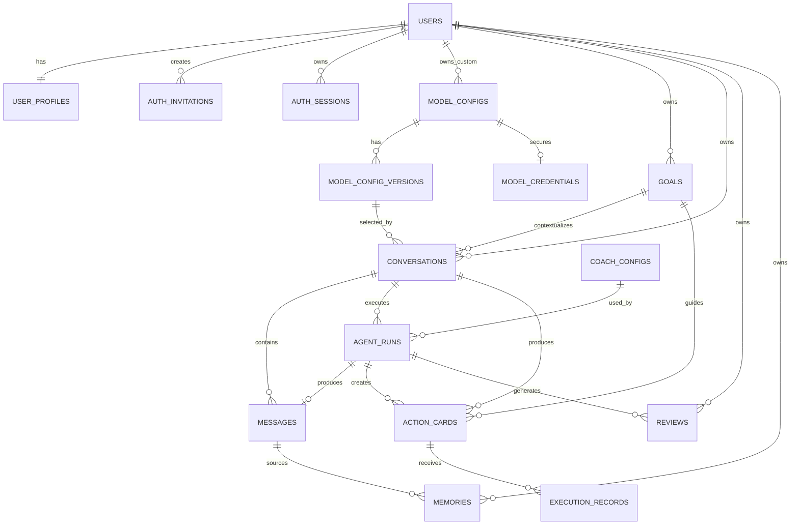

# 命运编译器：数据库设计

> 文档状态：P0 设计版  
> 关联技术文档：[技术落地方案](./01.技术落地方案.md)  
> 关联计划文档：[MVP 下一步实施计划](../03.plan/01.MVP下一步实施计划.md)  
> 目标版本：MVP 0.1  
> 数据库：PostgreSQL 16+  
> ORM：TypeORM  
> 更新日期：2026-07-16

## 1. 设计结论

MVP 使用一个 PostgreSQL 数据库保存认证、模型、会话、行动和复盘数据，不引入 Redis、向量数据库、独立统计库或消息队列。

本设计确定以下关键规则：

1. 用户、管理员和登录会话由 NestJS 自建认证管理；
2. 密码只保存 Argon2id 哈希，Refresh Token 和邀请码只保存摘要；
3. 后台模型与用户自定义模型共用模型注册表，通过所有者字段区分；
4. 模型稳定身份、模型版本和加密凭据分表保存；
5. 模型 API Key 使用 AES-256-GCM 加密，历史模型版本不复制密钥；
6. 会话创建时固定模型版本，并保存不含密钥的模型快照；
7. 后台修改默认模型或发布新版本，不影响已有会话；
8. 模型密钥轮换属于安全操作，后续调用立即使用新密钥，但历史模型快照不变；
9. 模型停用或用户删除自定义模型后，历史记录保留，但不能继续发起模型调用；
10. 每次 Agent 执行独立记录模型、教练配置、知识卡、Token、耗时和结果；
11. 用户数据查询必须同时带资源 ID 和当前 `user_id`；
12. 消息生成和外部模型调用不保持长数据库事务。

## 2. 数据库约定

### 2.1 命名与类型

- 表名和字段名使用 `snake_case`；
- 主键统一使用应用层生成的 UUID，类型为 `uuid`；
- 时间统一使用 `timestamptz`，以 UTC 保存；
- 金额和成本使用 `numeric`，不使用浮点数；
- Token 数量和持续时间使用非负整数；
- 可扩展结构使用 `jsonb`，固定关系优先使用普通字段和外键；
- 状态字段使用 `varchar` 加 `CHECK`，避免 PostgreSQL Enum 演进困难；
- 所有可编辑业务表包含 `created_at` 和 `updated_at`；
- 用户输入文本必须设置合理长度上限，并在 DTO 层再次校验。

UUID 在 NestJS 中通过 `crypto.randomUUID()` 生成，不要求数据库安装 UUID 扩展。

### 2.2 通用时间字段

除纯关联表外，业务表默认包含：

| 字段 | 类型 | 规则 |
| --- | --- | --- |
| `created_at` | `timestamptz` | 非空，默认 `now()` |
| `updated_at` | `timestamptz` | 非空，默认 `now()`，应用更新时维护 |

`updated_at` 首版由 TypeORM 维护，不创建数据库触发器。

### 2.3 JSONB 使用规则

JSONB 只用于以下场景：

- 模型能力和供应商扩展参数；
- 不含密钥的模型快照；
- 教练规则和输出 Schema；
- 知识卡的诊断内容；
- Agent 结构化输出和知识匹配快照；
- 用户少量非核心偏好。

所有 JSONB 在进入 Service 前必须经过 Zod 校验。不能把高频筛选字段只放在 JSONB 中。

### 2.4 删除约定

- 认证会话：标记撤销，过期后清理；
- 用户：首版以禁用为主，不直接物理删除；
- 系统模型：发布过或被引用后只能停用；
- 用户自定义模型：删除时标记删除并立即清除加密凭据；
- 模型版本、教练配置版本和知识卡版本：被引用后不物理删除；
- 会话：用户确认删除后，事务内级联删除消息、Agent Run、行动卡等会话内容；
- 记忆：用户删除时物理删除；
- 统计只保留业务运行所需数据，不以保留统计为理由阻止用户删除内容。

## 3. 核心实体关系



## 4. 表清单

| 分组 | 表 | 用途 |
| --- | --- | --- |
| 身份 | `users` | 用户和管理员账号 |
| 身份 | `user_profiles` | 用户资料和偏好 |
| 身份 | `auth_invitations` | 一次性邀请码 |
| 身份 | `auth_sessions` | Refresh Token 轮换和设备会话 |
| 模型 | `model_configs` | 模型稳定身份、所有权和当前状态 |
| 模型 | `model_config_versions` | 不可变模型配置版本 |
| 模型 | `model_credentials` | 模型加密 API Key |
| 教练 | `coach_configs` | 法典教练配置版本 |
| 知识 | `knowledge_cards` | 法典知识卡版本 |
| 业务 | `goals` | 用户目标和阶段 |
| 会话 | `conversations` | 咨询会话和绑定模型 |
| 会话 | `messages` | 用户与助手消息 |
| 运行 | `agent_runs` | 每次 Agent 执行记录 |
| 行动 | `action_cards` | 主要行动卡 |
| 行动 | `execution_records` | 行动执行反馈 |
| 复盘 | `reviews` | 每日、行动和阶段复盘 |
| 记忆 | `memories` | 用户长期记忆 |

## 5. 身份与用户

### 5.1 `users`

保存登录主体和角色，不保存大段用户画像。

| 字段 | 类型 | 空值 | 说明 |
| --- | --- | --- | --- |
| `id` | `uuid` | 否 | 主键 |
| `email` | `varchar(254)` | 是 | 邮箱，写入前转小写并去空格 |
| `username` | `varchar(50)` | 是 | 用户名，写入前标准化 |
| `password_hash` | `varchar(255)` | 否 | Argon2id 完整编码结果 |
| `role` | `varchar(20)` | 否 | `user` / `admin` |
| `status` | `varchar(20)` | 否 | `active` / `disabled` / `locked` |
| `password_changed_at` | `timestamptz` | 否 | 修改密码和全会话失效判断 |
| `failed_login_count` | `integer` | 否 | 连续失败次数，默认 0 |
| `last_failed_login_at` | `timestamptz` | 是 | 最近登录失败时间 |
| `locked_until` | `timestamptz` | 是 | 临时锁定截止时间 |
| `last_login_at` | `timestamptz` | 是 | 最近成功登录 |
| `created_by` | `uuid` | 是 | 管理员创建时记录，外键到 `users.id` |
| `created_at` | `timestamptz` | 否 | 创建时间 |
| `updated_at` | `timestamptz` | 否 | 更新时间 |

约束：

- `email` 和 `username` 至少一个非空；
- `role IN ('user', 'admin')`；
- `status IN ('active', 'disabled', 'locked')`；
- `failed_login_count >= 0`；
- `email` 使用唯一表达式索引 `lower(email)`；
- `username` 使用唯一表达式索引 `lower(username)`；
- 登录错误响应不能暴露邮箱或用户名是否存在。

索引：

- `ux_users_email_lower`：唯一，`lower(email)`，忽略空值；
- `ux_users_username_lower`：唯一，`lower(username)`，忽略空值；
- `idx_users_status`：`status`。

### 5.2 `user_profiles`

| 字段 | 类型 | 空值 | 说明 |
| --- | --- | --- | --- |
| `user_id` | `uuid` | 否 | 主键，外键到 `users.id`，`ON DELETE CASCADE` |
| `display_name` | `varchar(80)` | 是 | 显示名称 |
| `timezone` | `varchar(64)` | 否 | 默认 `Asia/Shanghai` |
| `locale` | `varchar(16)` | 否 | 默认 `zh-CN` |
| `onboarding_completed` | `boolean` | 否 | 默认 `false` |
| `preferences` | `jsonb` | 否 | 默认 `{}`，只保存非敏感设置 |
| `created_at` | `timestamptz` | 否 | 创建时间 |
| `updated_at` | `timestamptz` | 否 | 更新时间 |

`preferences` 不允许保存 Token、API Key、密码或完整聊天内容。

### 5.3 `auth_invitations`

邀请码只向用户展示一次，数据库保存 HMAC-SHA-256 摘要。

| 字段 | 类型 | 空值 | 说明 |
| --- | --- | --- | --- |
| `id` | `uuid` | 否 | 主键 |
| `code_hash` | `char(64)` | 否 | 邀请码 HMAC-SHA-256 摘要 |
| `target_role` | `varchar(20)` | 否 | 默认 `user` |
| `created_by` | `uuid` | 否 | 创建管理员 |
| `expires_at` | `timestamptz` | 否 | 过期时间 |
| `used_by` | `uuid` | 是 | 使用者 |
| `used_at` | `timestamptz` | 是 | 使用时间 |
| `revoked_at` | `timestamptz` | 是 | 撤销时间 |
| `created_at` | `timestamptz` | 否 | 创建时间 |

约束与索引：

- `code_hash` 唯一；
- `target_role IN ('user', 'admin')`，创建管理员邀请需要更高权限；
- 使用时必须满足未使用、未撤销且未过期；
- `idx_auth_invitations_expires_at`：用于清理过期邀请码。

### 5.4 `auth_sessions`

每次 Refresh Token 轮换创建新记录，旧记录标记撤销。

| 字段 | 类型 | 空值 | 说明 |
| --- | --- | --- | --- |
| `id` | `uuid` | 否 | 主键 |
| `user_id` | `uuid` | 否 | 会话所属用户 |
| `token_family_id` | `uuid` | 否 | 同一设备登录链 |
| `refresh_token_hash` | `char(64)` | 否 | Refresh Token HMAC-SHA-256 摘要 |
| `replaced_by_session_id` | `uuid` | 是 | 轮换后的新会话记录 |
| `device_name` | `varchar(100)` | 是 | 用户可识别设备名称 |
| `user_agent` | `varchar(500)` | 是 | 截断后的 User-Agent |
| `ip_address` | `inet` | 是 | 最近使用 IP，按隐私策略保留 |
| `expires_at` | `timestamptz` | 否 | 过期时间 |
| `last_used_at` | `timestamptz` | 是 | 最近刷新时间 |
| `revoked_at` | `timestamptz` | 是 | 撤销时间 |
| `revoke_reason` | `varchar(50)` | 是 | `rotated` / `logout` / `password_changed` / `admin_disabled` / `reuse_detected` |
| `created_at` | `timestamptz` | 否 | 创建时间 |

约束与索引：

- `refresh_token_hash` 唯一；
- `revoke_reason` 使用检查约束；
- `replaced_by_session_id` 自引用，`ON DELETE SET NULL`；
- `idx_auth_sessions_user_active`：`(user_id, expires_at)`，条件为 `revoked_at IS NULL`；
- `idx_auth_sessions_family`：`token_family_id`；
- 检测到已轮换 Token 被复用时，撤销整个 `token_family_id`。

## 6. 模型管理

### 6.1 模型版本设计

模型采用三层结构：

```text
model_configs
→ 稳定 ID、所有者、发布状态、当前草稿和当前发布版本

model_config_versions
→ Base URL、模型标识、超时、能力和扩展参数

model_credentials
→ 当前加密 API Key，不进入历史版本和会话快照
```

这样可以同时满足：

- 历史会话固定模型元数据；
- 后台发布新版本不改变旧会话；
- API Key 可以独立轮换；
- 删除自定义模型时能够立即销毁密钥；
- 普通模型查询不需要接触密钥表。

### 6.2 `model_configs`

| 字段 | 类型 | 空值 | 说明 |
| --- | --- | --- | --- |
| `id` | `uuid` | 否 | 主键，模型稳定 ID |
| `owner_type` | `varchar(20)` | 否 | `system` / `user` |
| `owner_user_id` | `uuid` | 是 | 用户自定义模型所有者 |
| `slug` | `varchar(80)` | 是 | 系统模型稳定标识 |
| `display_name` | `varchar(100)` | 否 | 客户端展示名称 |
| `model_type` | `varchar(20)` | 否 | `api` / `local` |
| `protocol` | `varchar(30)` | 否 | `openai_compatible` / `ollama` / `provider_specific` |
| `status` | `varchar(20)` | 否 | `draft` / `published` / `disabled` / `deleted` |
| `is_default` | `boolean` | 否 | 系统默认模型，默认 `false` |
| `is_selectable` | `boolean` | 否 | 是否允许客户端新建会话选择 |
| `current_draft_version_id` | `uuid` | 是 | 当前草稿版本 |
| `published_version_id` | `uuid` | 是 | 当前发布版本 |
| `created_by` | `uuid` | 否 | 创建者 |
| `updated_by` | `uuid` | 否 | 最近修改者 |
| `deleted_at` | `timestamptz` | 是 | 用户删除或管理员删除草稿时间 |
| `created_at` | `timestamptz` | 否 | 创建时间 |
| `updated_at` | `timestamptz` | 否 | 更新时间 |

检查约束：

- `owner_type = 'system'` 时 `owner_user_id IS NULL`；
- `owner_type = 'user'` 时 `owner_user_id IS NOT NULL`；
- 用户自定义模型只能使用 `model_type = 'api'`；
- `is_default = true` 只允许系统模型；
- `status = 'published'` 时 `published_version_id IS NOT NULL`；
- `(id, current_draft_version_id)` 和 `(id, published_version_id)` 分别通过组合外键关联 `model_config_versions(model_config_id, id)`，非空时必须属于当前模型；
- `status IN ('draft', 'published', 'disabled', 'deleted')`；
- `model_type IN ('api', 'local')`；
- `protocol` 使用白名单检查约束。

索引：

- `ux_model_configs_system_slug`：系统模型 `slug` 唯一；
- `idx_model_configs_user`：`(owner_user_id, status, updated_at DESC)`；
- `idx_model_configs_selectable`：`(status, is_selectable, display_name)`；
- `ux_model_configs_system_default`：条件唯一索引，只允许一个 `owner_type='system' AND is_default=true AND status='published'`。

删除规则：

- 从未发布、未被会话引用的草稿可以物理删除；
- 其他系统模型只能设为 `disabled`；
- 用户删除自定义模型时设为 `deleted`、`is_selectable=false`，并物理删除 `model_credentials`；
- `deleted` 或 `disabled` 模型的历史会话可读，但不能继续调用。

### 6.3 `model_config_versions`

发布后的版本不可修改。修改模型参数时创建新草稿版本。

| 字段 | 类型 | 空值 | 说明 |
| --- | --- | --- | --- |
| `id` | `uuid` | 否 | 主键 |
| `model_config_id` | `uuid` | 否 | 模型稳定 ID |
| `version` | `integer` | 否 | 从 1 递增 |
| `version_status` | `varchar(20)` | 否 | `draft` / `published` / `superseded` |
| `provider` | `varchar(50)` | 是 | 供应商标识 |
| `base_url` | `varchar(500)` | 否 | 服务端请求地址 |
| `model_name` | `varchar(120)` | 否 | 供应商模型标识 |
| `timeout_ms` | `integer` | 否 | 默认 60000 |
| `max_output_tokens` | `integer` | 否 | 最大输出 Token |
| `supports_stream` | `boolean` | 否 | 是否支持流式 |
| `supports_structured_output` | `boolean` | 否 | 是否支持结构化输出 |
| `capabilities` | `jsonb` | 否 | 默认 `{}`，能力描述 |
| `request_options` | `jsonb` | 否 | 默认 `{}`，允许的非敏感调用参数 |
| `config_checksum` | `char(64)` | 否 | 规范化配置摘要 |
| `created_by` | `uuid` | 否 | 创建者 |
| `published_at` | `timestamptz` | 是 | 发布时间 |
| `created_at` | `timestamptz` | 否 | 创建时间 |

约束：

- `(model_config_id, version)` 唯一；
- `(model_config_id, id)` 唯一，用于模型主体和会话建立组合外键；
- `version > 0`；
- `timeout_ms BETWEEN 1000 AND 300000`；
- `max_output_tokens BETWEEN 1 AND 100000`；
- `version_status IN ('draft', 'published', 'superseded')`；
- `published` 或 `superseded` 版本禁止更新；
- `request_options` 禁止包含 `api_key`、`authorization`、`token`、`secret` 等敏感键；
- `base_url` 在 Service 层执行协议、主机和 SSRF 白名单校验。

索引：

- `ux_model_config_versions_number`：`(model_config_id, version)` 唯一；
- `idx_model_config_versions_status`：`(model_config_id, version_status, version DESC)`。

### 6.4 `model_credentials`

该表只能由模型凭据 Repository 读取，普通模型查询禁止关联此表。

| 字段 | 类型 | 空值 | 说明 |
| --- | --- | --- | --- |
| `model_config_id` | `uuid` | 否 | 主键，外键到 `model_configs.id`，`ON DELETE CASCADE` |
| `ciphertext` | `bytea` | 否 | AES-256-GCM 密文 |
| `iv` | `bytea` | 否 | 每次加密随机生成的 12 字节 IV |
| `auth_tag` | `bytea` | 否 | GCM 认证标签 |
| `key_version` | `smallint` | 否 | 主加密密钥版本 |
| `secret_hint` | `varchar(20)` | 是 | 仅保存末尾少量字符，例如 `…A1B2` |
| `updated_by` | `uuid` | 否 | 最近更新者 |
| `created_at` | `timestamptz` | 否 | 创建时间 |
| `updated_at` | `timestamptz` | 否 | 更新时间 |

安全规则：

- 主加密密钥只存在 NestJS 环境变量或部署平台 Secret 中；
- `ciphertext`、`iv`、`auth_tag` 和 `key_version` 必须一起读取；
- 解密只发生在实际模型调用前的最小代码范围内；
- 解密结果不进入日志、异常、缓存、Agent Run 或会话快照；
- 密钥更新覆盖当前凭据，不创建历史明文或历史密文副本；
- 自定义模型删除时立即删除该行；
- 数据库备份属于敏感数据，必须加密和限制访问。

模型凭据加密密钥与 Token 摘要密钥必须分离。建议分别使用 `MODEL_CREDENTIAL_MASTER_KEY` 和 `TOKEN_HASH_KEY`，不能复用 JWT 签名密钥。

### 6.5 模型发布事务

发布模型必须在一个事务中完成：

1. `SELECT ... FOR UPDATE` 锁定 `model_configs`；
2. 校验目标版本属于该模型且状态为 `draft`；
3. 校验 Base URL、模型名称、能力和连接测试结果；
4. 将旧发布版本标记为 `superseded`；
5. 将目标版本标记为 `published` 并写入 `published_at`；
6. 更新 `model_configs.published_version_id`；
7. 设置 `model_configs.status='published'`；
8. 如设为默认模型，在同一事务中取消其他系统模型的默认状态。

## 7. 教练配置与知识库

### 7.1 `coach_configs`

一行代表一个不可变发布版本；草稿允许编辑，发布后禁止修改。

| 字段 | 类型 | 空值 | 说明 |
| --- | --- | --- | --- |
| `id` | `uuid` | 否 | 主键 |
| `version` | `integer` | 否 | 递增版本号 |
| `name` | `varchar(100)` | 否 | 配置名称 |
| `role_definition` | `text` | 否 | 角色定义 |
| `product_goal` | `text` | 否 | 产品目标 |
| `system_prompt` | `text` | 否 | 系统提示词 |
| `conversation_rules` | `jsonb` | 否 | 对话原则和追问规则 |
| `action_rules` | `jsonb` | 否 | 行动卡约束 |
| `prohibited_content` | `jsonb` | 否 | 禁止事项 |
| `safety_rules` | `jsonb` | 否 | 安全边界 |
| `output_schema` | `jsonb` | 否 | 结构化输出 Schema |
| `default_model_config_id` | `uuid` | 是 | 新会话默认模型 |
| `status` | `varchar(20)` | 否 | `draft` / `published` / `disabled` |
| `created_by` | `uuid` | 否 | 创建管理员 |
| `published_at` | `timestamptz` | 是 | 发布时间 |
| `created_at` | `timestamptz` | 否 | 创建时间 |
| `updated_at` | `timestamptz` | 否 | 更新时间 |

约束与索引：

- `version` 唯一且大于 0；
- 只允许一个 `status='published'` 的教练配置，使用条件唯一索引；
- 发布后禁止更新正文，只允许停用；
- `default_model_config_id` 只影响新会话默认选项，不替换会话已选模型。

### 7.2 `knowledge_cards`

一张法典知识卡通过 `card_key` 保持稳定身份，每个版本占一行。

| 字段 | 类型 | 空值 | 说明 |
| --- | --- | --- | --- |
| `id` | `uuid` | 否 | 版本主键 |
| `card_key` | `varchar(80)` | 否 | 稳定业务标识，例如 `focus` |
| `version` | `integer` | 否 | 版本号 |
| `name` | `varchar(100)` | 否 | 名称 |
| `category` | `varchar(50)` | 否 | 分类 |
| `tags` | `text[]` | 否 | 标签，默认空数组 |
| `problem_signals` | `text[]` | 否 | 问题信号 |
| `variables` | `jsonb` | 否 | 关联变量 |
| `diagnostic_questions` | `jsonb` | 否 | 诊断问题 |
| `candidate_actions` | `jsonb` | 否 | 可选行动 |
| `stop_doing` | `text[]` | 否 | 禁止或停止事项 |
| `review_questions` | `text[]` | 否 | 复盘问题 |
| `status` | `varchar(20)` | 否 | `draft` / `published` / `disabled` |
| `created_by` | `uuid` | 否 | 创建者 |
| `published_at` | `timestamptz` | 是 | 发布时间 |
| `created_at` | `timestamptz` | 否 | 创建时间 |
| `updated_at` | `timestamptz` | 否 | 更新时间 |

约束与索引：

- `(card_key, version)` 唯一；
- 同一个 `card_key` 只允许一个发布版本，使用条件唯一索引；
- `tags` 和 `problem_signals` 建立 GIN 索引；
- `(status, category)` 建立普通索引；
- 发布版本不可修改；修改时创建新版本；
- Agent Run 保存匹配卡片的 ID、版本、名称和原因快照。

## 8. 目标、会话与消息

### 8.1 `goals`

| 字段 | 类型 | 空值 | 说明 |
| --- | --- | --- | --- |
| `id` | `uuid` | 否 | 主键 |
| `user_id` | `uuid` | 否 | 所属用户 |
| `title` | `varchar(150)` | 否 | 目标标题 |
| `description` | `text` | 是 | 目标描述 |
| `current_stage` | `varchar(100)` | 是 | 当前阶段 |
| `status` | `varchar(20)` | 否 | `active` / `paused` / `completed` / `abandoned` |
| `priority` | `smallint` | 否 | 默认 0 |
| `target_date` | `date` | 是 | 目标日期 |
| `completed_at` | `timestamptz` | 是 | 完成时间 |
| `created_at` | `timestamptz` | 否 | 创建时间 |
| `updated_at` | `timestamptz` | 否 | 更新时间 |

索引：

- `idx_goals_user_status`：`(user_id, status, updated_at DESC)`。

### 8.2 `conversations`

会话创建后固定模型版本。首版不允许在同一会话内无痕切换模型。

| 字段 | 类型 | 空值 | 说明 |
| --- | --- | --- | --- |
| `id` | `uuid` | 否 | 主键 |
| `user_id` | `uuid` | 否 | 会话所有者 |
| `goal_id` | `uuid` | 是 | 关联目标 |
| `title` | `varchar(150)` | 是 | 会话标题 |
| `status` | `varchar(30)` | 否 | `active` / `archived` / `model_unavailable` |
| `model_source` | `varchar(20)` | 否 | `managed` / `custom` |
| `model_config_id` | `uuid` | 否 | 模型稳定 ID |
| `model_config_version_id` | `uuid` | 否 | 固定模型版本 |
| `model_snapshot` | `jsonb` | 否 | 不含密钥的模型快照 |
| `summary` | `text` | 是 | 用于新会话继承的摘要 |
| `last_message_at` | `timestamptz` | 是 | 最近消息时间 |
| `created_at` | `timestamptz` | 否 | 创建时间 |
| `updated_at` | `timestamptz` | 否 | 更新时间 |

`model_snapshot` 最少保存：

```json
{
  "displayName": "示例模型",
  "ownerType": "system",
  "modelType": "api",
  "protocol": "openai_compatible",
  "provider": "example",
  "baseUrl": "https://api.example.com/v1",
  "modelName": "example-model",
  "version": 3,
  "supportsStream": true,
  "supportsStructuredOutput": true
}
```

模型快照禁止包含：

- API Key；
- Authorization Header；
- 环境变量内容；
- 供应商返回的敏感错误体；
- 用户输入的自定义请求头。

约束与索引：

- `model_source IN ('managed', 'custom')`；
- `(model_config_id, model_config_version_id)` 使用组合外键关联 `model_config_versions(model_config_id, id)`，数据库直接保证版本属于该模型；
- `model_source='custom'` 时模型所有者必须等于会话用户；
- 新建会话只允许使用已发布、可选择且凭据可用的模型；
- `idx_conversations_user_recent`：`(user_id, last_message_at DESC, created_at DESC)`；
- `idx_conversations_goal`：`(user_id, goal_id)`；
- `idx_conversations_model_version`：`model_config_version_id`。

模型不可用规则：

- 系统模型停用、用户删除自定义模型或凭据被清除后，将会话标记为 `model_unavailable`；
- 历史消息仍可读取；
- 再次发送消息时返回明确业务错误，要求选择模型创建新会话；
- 可将当前会话摘要带入新会话，但不复制隐藏 Prompt 或密钥。

### 8.3 `messages`

| 字段 | 类型 | 空值 | 说明 |
| --- | --- | --- | --- |
| `id` | `uuid` | 否 | 主键 |
| `conversation_id` | `uuid` | 否 | 所属会话，`ON DELETE CASCADE` |
| `user_id` | `uuid` | 否 | 冗余所有者字段，便于权限查询 |
| `sequence` | `integer` | 否 | 会话内递增序号 |
| `role` | `varchar(20)` | 否 | `user` / `assistant` / `system` |
| `content` | `text` | 否 | 消息正文 |
| `content_json` | `jsonb` | 是 | 诊断卡等结构化内容 |
| `status` | `varchar(20)` | 否 | `streaming` / `completed` / `failed` |
| `agent_run_id` | `uuid` | 是 | 生成该消息的 Agent Run |
| `completed_at` | `timestamptz` | 是 | 流式完成时间 |
| `created_at` | `timestamptz` | 否 | 创建时间 |
| `updated_at` | `timestamptz` | 否 | 流式更新时维护 |

约束与索引：

- `(conversation_id, sequence)` 唯一；
- `sequence > 0`；
- `role IN ('user', 'assistant', 'system')`；
- `status IN ('streaming', 'completed', 'failed')`；
- `idx_messages_conversation_sequence`：`(conversation_id, sequence)`；
- `idx_messages_user_created`：`(user_id, created_at DESC)`；
- Service 必须校验 `messages.user_id = conversations.user_id`。

消息序号通过事务内锁定会话并读取当前最大序号，或在会话表后续增加计数器。MVP 首选事务内锁定会话，避免提前维护冗余计数。

## 9. Agent 执行记录

### 9.1 `agent_runs`

每次模型生成对应一行，即使失败也必须保留运行状态和脱敏错误信息。

| 字段 | 类型 | 空值 | 说明 |
| --- | --- | --- | --- |
| `id` | `uuid` | 否 | 主键 |
| `user_id` | `uuid` | 否 | 所属用户 |
| `conversation_id` | `uuid` | 否 | 所属会话，`ON DELETE CASCADE` |
| `request_message_id` | `uuid` | 否 | 用户消息 |
| `response_message_id` | `uuid` | 是 | 助手消息 |
| `idempotency_key` | `varchar(100)` | 否 | 客户端每次发送生成的 UUID |
| `status` | `varchar(20)` | 否 | `running` / `succeeded` / `failed` / `timeout` / `cancelled` |
| `model_config_id` | `uuid` | 否 | 模型稳定 ID |
| `model_config_version_id` | `uuid` | 否 | 实际模型版本 |
| `model_snapshot` | `jsonb` | 否 | 实际调用模型快照，不含 Key |
| `coach_config_id` | `uuid` | 否 | 使用的教练配置版本 |
| `coach_config_snapshot` | `jsonb` | 否 | 名称和版本等最小快照，不保存完整敏感 Prompt |
| `matched_knowledge_cards` | `jsonb` | 否 | 默认 `[]`，最多三个匹配卡片快照 |
| `prompt_version` | `varchar(50)` | 否 | 程序 Prompt 组合版本 |
| `input_tokens` | `integer` | 是 | 输入 Token |
| `output_tokens` | `integer` | 是 | 输出 Token |
| `estimated_cost` | `numeric(14,6)` | 是 | 估算成本 |
| `provider_request_id` | `varchar(150)` | 是 | 供应商请求 ID |
| `duration_ms` | `integer` | 是 | 总耗时 |
| `result_json` | `jsonb` | 是 | 通过 Zod 校验的最终结果 |
| `error_code` | `varchar(80)` | 是 | 内部稳定错误码 |
| `error_message` | `varchar(500)` | 是 | 脱敏错误摘要 |
| `started_at` | `timestamptz` | 否 | 开始时间 |
| `completed_at` | `timestamptz` | 是 | 完成时间 |
| `created_at` | `timestamptz` | 否 | 创建时间 |

约束：

- Token、成本、耗时均不得为负数；
- `(user_id, idempotency_key)` 唯一，相同幂等键直接返回已有 Run；
- `(model_config_id, model_config_version_id)` 使用组合外键保证版本归属；
- `matched_knowledge_cards` 最多三个元素，由 Zod 校验；
- `result_json` 只能在通过结构校验后写入；
- `error_message` 不保存完整供应商响应、请求头、Prompt、聊天正文或堆栈；
- 运行完成后状态不可回到 `running`；
- `model_snapshot` 和 `coach_config_snapshot` 均不得包含密钥。

索引：

- `idx_agent_runs_conversation`：`(conversation_id, created_at DESC)`；
- `ux_agent_runs_user_idempotency`：`(user_id, idempotency_key)` 唯一；
- `idx_agent_runs_user_recent`：`(user_id, created_at DESC)`；
- `idx_agent_runs_status`：`(status, created_at DESC)`；
- `idx_agent_runs_model_version`：`(model_config_version_id, created_at DESC)`；
- `idx_agent_runs_coach_config`：`(coach_config_id, created_at DESC)`。

### 9.2 Agent 执行事务边界

模型调用可能持续数十秒，禁止在调用期间保持数据库事务或行锁。

正确流程：

```text
事务 A
→ 校验用户、会话和模型可用性
→ 创建用户消息
→ 创建 status=running 的 Agent Run
→ 提交事务

事务外
→ 读取上下文
→ 调用模型
→ 流式响应
→ 校验结构化结果

事务 B
→ 创建或完成助手消息
→ 创建行动卡
→ 更新 Agent Run 为 succeeded
→ 更新 conversations.last_message_at
→ 提交事务
```

失败时使用独立短事务将 Agent Run 更新为 `failed` 或 `timeout`，并将未完成助手消息标记为 `failed`。

SSE 的每个文本片段只发送给客户端，不逐 Token 更新 PostgreSQL。模型结束或达到安全检查点后再保存完整助手消息，避免大量小事务和行更新。

为避免客户端重试产生重复消息，发送消息 API 必须提交 UUID 幂等键。API 设计阶段只需确定请求头或请求体字段名称。

## 10. 行动、反馈、复盘与记忆

### 10.1 `action_cards`

| 字段 | 类型 | 空值 | 说明 |
| --- | --- | --- | --- |
| `id` | `uuid` | 否 | 主键 |
| `user_id` | `uuid` | 否 | 所属用户 |
| `conversation_id` | `uuid` | 否 | 来源会话，`ON DELETE CASCADE` |
| `agent_run_id` | `uuid` | 否 | 来源 Agent Run，`ON DELETE CASCADE` |
| `goal_id` | `uuid` | 是 | 关联目标 |
| `is_primary` | `boolean` | 否 | 默认 `true` |
| `title` | `varchar(150)` | 否 | 行动标题 |
| `duration_minutes` | `integer` | 是 | 预计时长 |
| `deliverable` | `text` | 否 | 交付物 |
| `completion_criteria` | `text[]` | 否 | 完成标准 |
| `stop_doing` | `text[]` | 否 | 停止事项 |
| `status` | `varchar(30)` | 否 | `pending` / `in_progress` / `completed` / `partially_completed` / `not_completed` / `abandoned` |
| `due_at` | `timestamptz` | 是 | 计划完成时间 |
| `completed_at` | `timestamptz` | 是 | 完成时间 |
| `created_at` | `timestamptz` | 否 | 创建时间 |
| `updated_at` | `timestamptz` | 否 | 更新时间 |

约束与索引：

- `duration_minutes BETWEEN 1 AND 1440`，允许空值；
- 每个 Agent Run 最多一张 `is_primary=true` 的行动卡，使用条件唯一索引；
- `idx_action_cards_user_status`：`(user_id, status, due_at)`；
- `idx_action_cards_goal`：`(goal_id, created_at DESC)`。

### 10.2 `execution_records`

| 字段 | 类型 | 空值 | 说明 |
| --- | --- | --- | --- |
| `id` | `uuid` | 否 | 主键 |
| `user_id` | `uuid` | 否 | 所属用户 |
| `action_card_id` | `uuid` | 否 | 行动卡，`ON DELETE CASCADE` |
| `result` | `varchar(30)` | 否 | `completed` / `partially_completed` / `not_completed` |
| `note` | `text` | 是 | 用户反馈 |
| `obstacle_type` | `varchar(40)` | 是 | `direction` / `ability` / `execution` / `resource` / `timing` / `emotion` / `other` |
| `evidence` | `jsonb` | 否 | 默认 `{}`，首版不保存大文件 |
| `submitted_at` | `timestamptz` | 否 | 提交时间 |
| `created_at` | `timestamptz` | 否 | 创建时间 |

允许同一行动卡多次反馈，用于记录尝试过程。每次写入反馈时，在同一事务中更新 `action_cards.status` 和必要的 `completed_at`。

索引：

- `idx_execution_records_action`：`(action_card_id, submitted_at DESC)`；
- `idx_execution_records_user`：`(user_id, submitted_at DESC)`。

### 10.3 `reviews`

| 字段 | 类型 | 空值 | 说明 |
| --- | --- | --- | --- |
| `id` | `uuid` | 否 | 主键 |
| `user_id` | `uuid` | 否 | 所属用户 |
| `review_type` | `varchar(20)` | 否 | `action` / `daily` / `stage` |
| `action_card_id` | `uuid` | 是 | 行动复盘关联行动卡 |
| `generated_by_run_id` | `uuid` | 是 | 生成复盘的 Agent Run |
| `period_start` | `date` | 是 | 周期开始 |
| `period_end` | `date` | 是 | 周期结束 |
| `summary` | `text` | 否 | 复盘摘要 |
| `progress` | `jsonb` | 否 | 默认 `{}` |
| `frictions` | `jsonb` | 否 | 默认 `[]` |
| `next_focus` | `text` | 是 | 下一阶段重点 |
| `created_at` | `timestamptz` | 否 | 创建时间 |
| `updated_at` | `timestamptz` | 否 | 更新时间 |

索引：

- `idx_reviews_user_type`：`(user_id, review_type, created_at DESC)`；
- `idx_reviews_period`：`(user_id, period_start, period_end)`。

### 10.4 `memories`

| 字段 | 类型 | 空值 | 说明 |
| --- | --- | --- | --- |
| `id` | `uuid` | 否 | 主键 |
| `user_id` | `uuid` | 否 | 所属用户 |
| `source_conversation_id` | `uuid` | 是 | 来源会话，删除会话后置空 |
| `source_message_id` | `uuid` | 是 | 来源消息，删除消息后置空 |
| `category` | `varchar(40)` | 否 | `goal` / `preference` / `constraint` / `pattern` / `context` |
| `content` | `text` | 否 | 记忆内容 |
| `confidence` | `numeric(4,3)` | 是 | 0～1 |
| `confirmed_by_user` | `boolean` | 否 | 默认 `false` |
| `last_used_at` | `timestamptz` | 是 | 最近用于上下文时间 |
| `created_at` | `timestamptz` | 否 | 创建时间 |
| `updated_at` | `timestamptz` | 否 | 更新时间 |

约束与索引：

- `confidence BETWEEN 0 AND 1`；
- `idx_memories_user_category`：`(user_id, category, updated_at DESC)`；
- 用户删除记忆时物理删除；
- 系统自动提取的敏感记忆默认要求用户确认后才用于后续咨询。

## 11. 外键与级联规则

| 来源 | 目标 | 删除行为 |
| --- | --- | --- |
| `user_profiles.user_id` | `users.id` | `CASCADE` |
| `auth_invitations.created_by` | `users.id` | `RESTRICT` |
| `auth_invitations.used_by` | `users.id` | `SET NULL` |
| `auth_sessions.user_id` | `users.id` | `CASCADE` |
| `model_configs.owner_user_id` | `users.id` | `RESTRICT`，先执行账号删除流程 |
| `model_config_versions.model_config_id` | `model_configs.id` | `CASCADE`，仅允许未引用草稿物理删除 |
| `model_credentials.model_config_id` | `model_configs.id` | `CASCADE` |
| `coach_configs.default_model_config_id` | `model_configs.id` | `SET NULL` |
| `goals.user_id` | `users.id` | `CASCADE` |
| `conversations.user_id` | `users.id` | `RESTRICT`，先删除用户内容 |
| `conversations.goal_id` | `goals.id` | `SET NULL` |
| `conversations.model_config_id` | `model_configs.id` | `RESTRICT` |
| `conversations.model_config_version_id` | `model_config_versions.id` | `RESTRICT` |
| `messages.conversation_id` | `conversations.id` | `CASCADE` |
| `messages.user_id` | `users.id` | `RESTRICT` |
| `messages.agent_run_id` | `agent_runs.id` | `SET NULL`，延迟约束 |
| `agent_runs.conversation_id` | `conversations.id` | `CASCADE` |
| `agent_runs.user_id` | `users.id` | `RESTRICT` |
| `agent_runs.request_message_id` | `messages.id` | `RESTRICT`，延迟约束 |
| `agent_runs.response_message_id` | `messages.id` | `SET NULL`，延迟约束 |
| `agent_runs.model_config_id` | `model_configs.id` | `RESTRICT` |
| `agent_runs.model_config_version_id` | `model_config_versions.id` | `RESTRICT` |
| `agent_runs.coach_config_id` | `coach_configs.id` | `RESTRICT` |
| `action_cards.conversation_id` | `conversations.id` | `CASCADE` |
| `action_cards.agent_run_id` | `agent_runs.id` | `CASCADE` |
| `action_cards.goal_id` | `goals.id` | `SET NULL` |
| `action_cards.user_id` | `users.id` | `RESTRICT` |
| `execution_records.action_card_id` | `action_cards.id` | `CASCADE` |
| `execution_records.user_id` | `users.id` | `RESTRICT` |
| `reviews.user_id` | `users.id` | `CASCADE` |
| `reviews.action_card_id` | `action_cards.id` | `SET NULL` |
| `reviews.generated_by_run_id` | `agent_runs.id` | `SET NULL` |
| `memories.user_id` | `users.id` | `CASCADE` |
| `memories.source_conversation_id` | `conversations.id` | `SET NULL` |
| `memories.source_message_id` | `messages.id` | `SET NULL` |

由于 `memories` 可能引用即将删除的消息，删除会话前数据库会先通过 `SET NULL` 保留用户仍选择保留的记忆。若产品要求删除会话同时删除来源记忆，应在 Service 事务中明确删除，而不是依赖隐式级联。

## 12. 关键事务

### 12.1 邀请注册

一个事务内完成：

1. 按 `code_hash` 查询并 `FOR UPDATE` 锁定邀请码；
2. 校验未使用、未撤销、未过期；
3. 校验邮箱和用户名唯一；
4. 创建 `users`；
5. 创建 `user_profiles`；
6. 更新邀请码 `used_by` 和 `used_at`；
7. 提交事务。

### 12.2 Refresh Token 轮换

一个事务内完成：

1. 按 Token 摘要查询并锁定 `auth_sessions`；
2. 校验用户状态、Token 未撤销且未过期；
3. 若发现已被替换的 Token 再次使用，撤销整个 Token Family；
4. 将旧记录标记 `rotated`；
5. 创建新的 Refresh Token 记录；
6. 写入 `replaced_by_session_id`；
7. 提交后才返回新 Token。

Access Token 校验时还要比较 JWT `iat` 与 `users.password_changed_at`；早于最近改密时间的 Access Token 直接失效。

### 12.3 创建会话

一个事务内完成：

1. 校验用户状态；
2. 查询模型主体和发布版本；
3. 校验系统模型可选择，或自定义模型属于当前用户；
4. 校验模型未停用、未删除且凭据可用；
5. 生成不含 Key 的模型快照；
6. 创建 `conversations`。

### 12.4 提交执行反馈

一个事务内完成：

1. 使用 `user_id` 和 `action_card_id` 查询并锁定行动卡；
2. 创建 `execution_records`；
3. 根据反馈更新行动卡状态；
4. 完成时写入 `completed_at`；
5. 提交事务。

### 12.5 删除用户自定义模型

一个事务内完成：

1. 使用模型 ID 和当前 `user_id` 锁定模型；
2. 标记模型 `status='deleted'`、`is_selectable=false`、写入 `deleted_at`；
3. 删除 `model_credentials`；
4. 将引用该模型的活动会话标记为 `model_unavailable`；
5. 提交事务。

历史 `model_config_versions`、会话 `model_snapshot` 和 Agent Run 快照继续保留，但不能恢复 API Key。

## 13. 查询与性能基线

### 13.1 用户资源查询

普通用户查询不得先按资源 ID 查询后再单独判断归属，应直接使用组合条件：

```sql
SELECT id, title, status, last_message_at
FROM conversations
WHERE id = $1
  AND user_id = $2;
```

TypeORM 查询同样必须同时传入 `id` 和 `userId`。

### 13.2 列表查询

- 默认使用游标或基于 `created_at + id` 的稳定分页；
- 管理后台首版可以使用限制总量的 Offset 分页；
- 列表只选择展示所需字段，不加载消息正文、完整 JSONB 或模型凭据；
- 会话列表不逐条查询最后一条消息，优先使用 `conversations.last_message_at` 和后续可选的摘要字段；
- Agent Run 列表不加载 `result_json`，详情接口再读取。

### 13.3 首版容量假设

首版按以下规模设计：

- 20～30 名测试用户；
- 每名用户数百个会话以内；
- 每个会话数十条消息；
- 12～20 张已发布知识卡；
- 单实例 NestJS；
- 单 PostgreSQL 实例。

现有索引足以支持 MVP，不提前增加分区表、读写分离、物化视图和统计汇总表。

## 14. Migration 顺序

建议按以下顺序创建 Migration：

1. `001_create_users`
2. `002_create_user_profiles`
3. `003_create_auth_invitations`
4. `004_create_auth_sessions`
5. `005_create_model_configs`
6. `006_create_model_config_versions`
7. `007_add_model_current_version_fks`
8. `008_create_model_credentials`
9. `009_create_coach_configs`
10. `010_create_knowledge_cards`
11. `011_create_goals`
12. `012_create_conversations`
13. `013_create_messages`
14. `014_create_agent_runs`
15. `015_add_message_agent_run_fks`
16. `016_create_action_cards`
17. `017_create_execution_records`
18. `018_create_reviews`
19. `019_create_memories`
20. `020_create_partial_indexes_and_checks`

`model_configs` 与 `model_config_versions`、`messages` 与 `agent_runs` 存在双向引用，因此先创建基础表，再通过后续 Migration 增加循环外键。模型版本相关外键使用组合键校验归属；循环外键设置为 `DEFERRABLE INITIALLY DEFERRED`，保证发布和级联删除事务能够在提交时统一校验。

所有 Migration 必须：

- 提供 `up` 和可安全执行的 `down`；
- 不依赖 Docker；
- 在空数据库执行成功；
- 在测试数据存在时执行成功；
- 禁止在应用启动时自动使用 `synchronize: true` 修改生产结构。

## 15. 首批种子数据

开发环境种子数据包含：

1. 一个管理员账号，密码通过环境变量或一次性命令输入，不写入仓库；
2. 一个固定测试用户；
3. 一个系统 API 模型配置占位记录，不包含真实 Key；
4. 一个 Ollama 本地模型配置，例如服务地址 `http://127.0.0.1:11434`；
5. 一个已发布教练配置；
6. 12 张首批法典知识卡；
7. 20 条 Agent 评测问题放在 `evals`，不写入生产业务表。

生产环境禁止自动创建默认密码。第一个管理员通过专用 CLI 命令创建，并在首次登录后强制修改密码。

## 16. 数据安全要求

### 16.1 禁止保存的内容

以下内容不得以明文进入数据库：

- 用户密码；
- Refresh Token；
- 邀请码；
- 模型 API Key；
- Authorization Header；
- 主加密密钥；
- 第三方服务完整敏感错误体。

### 16.2 数据库账号

- 应用使用独立数据库账号；
- 生产环境不使用 PostgreSQL 超级用户连接；
- 应用账号只拥有业务 Schema 所需权限；
- Migration 可以使用独立高权限账号；
- 备份账号只授予读取和备份所需权限；
- 数据库连接必须通过 TLS 或受信任内网。

### 16.3 日志与审计

数据库设计不单独创建复杂审计仓库。Pino 日志记录：

- 请求 ID；
- 用户 ID；
- 资源 ID；
- 操作类型；
- 成功或失败；
- 稳定错误码；
- 耗时。

日志禁止记录密码、Token、API Key、完整聊天正文和完整模型请求体。

管理后台查看完整用户对话属于高风险操作。若 MVP 开放该能力，需要新增最小 `admin_audit_events` 表；在该能力实现前，后台只提供脱敏摘要和统计。

## 17. 待接口实现阶段确认

以下内容不影响本次表结构主体，但需要在 NestJS DTO、Controller 和 E2E 测试中最终确定：

1. 消息发送接口的幂等键格式；
2. SSE 事件类型和断线重连策略；
3. 会话删除是立即物理删除还是设置短暂撤销期；
4. 用户自定义模型连接测试的频率限制；
5. 用户自定义 Base URL 是否只允许公网 HTTPS；
6. 管理后台是否在 MVP 查看完整对话；
7. 用户账号完整删除和数据导出的产品规则；
8. Token 和成本由供应商返回还是服务端估算；
9. 是否需要独立保存 Prompt 组合摘要。

默认实现建议：

- 消息接口要求 UUID 幂等键；
- 自定义模型只允许公网 HTTPS，系统本地模型由管理员配置内网地址；
- MVP 后台不展示完整对话正文；
- 会话删除采用立即事务删除；
- Prompt 正文不复制到 Agent Run，只保存教练配置 ID、版本和组合校验值。

## 18. 数据库验收清单

### 18.1 结构

- [ ] 所有表、字段、外键和检查约束已通过 Migration 创建；
- [ ] 所有状态字段都有数据库检查约束；
- [ ] 所有用户业务表都有明确的 `user_id` 或可追溯所有权；
- [ ] 核心列表查询存在对应索引；
- [ ] 循环外键通过后续 Migration 安全添加；
- [ ] 生产配置关闭 TypeORM `synchronize`。

### 18.2 认证安全

- [ ] 密码只保存 Argon2id 哈希；
- [ ] 邀请码和 Refresh Token 只保存摘要；
- [ ] Refresh Token 支持轮换和复用检测；
- [ ] 修改密码或禁用用户能够撤销全部会话；
- [ ] 邮箱和用户名大小写不敏感唯一。

### 18.3 模型安全与版本

- [ ] API Key 使用 AES-256-GCM 加密；
- [ ] 模型普通查询不会关联 `model_credentials`；
- [ ] 模型版本和会话快照不含 API Key；
- [ ] 新模型版本不会修改已有会话；
- [ ] API Key 轮换后已有会话使用新凭据但保留旧元数据快照；
- [ ] 停用或删除模型后不能创建新会话；
- [ ] 用户删除自定义模型会清除凭据并保留历史快照；
- [ ] 已被引用的模型和版本不能物理删除。

### 18.4 业务闭环

- [ ] 可以创建用户和目标；
- [ ] 可以选择模型创建会话；
- [ ] 可以按顺序保存用户和助手消息；
- [ ] 每次模型调用都有 Agent Run；
- [ ] Agent Run 可追溯模型、教练配置和知识卡；
- [ ] 一次 Agent Run 最多创建一张主要行动卡；
- [ ] 可以记录多次行动反馈；
- [ ] 可以生成复盘和下一步重点；
- [ ] 用户可以查看和删除自己的记忆；
- [ ] 用户删除会话时不会留下无法归属的消息或 Agent Run。

### 18.5 性能与可靠性

- [ ] 关键用户列表查询通过 `EXPLAIN` 命中索引；
- [ ] 模型调用期间不保持数据库事务；
- [ ] 发布模型、注册、Token 轮换和提交反馈使用短事务；
- [ ] 列表接口不产生 N+1 查询；
- [ ] Agent Run 列表不默认加载大型 JSONB；
- [ ] 备份可以恢复到独立测试数据库。

## 19. P0 完成定义

本数据库设计文档完成后，P0 的数据库部分达到以下状态：

- 核心实体和关系已经确定；
- 模型版本、会话固定模型和密钥轮换规则已经确定；
- 自建认证所需字段和 Token 轮换机制已经确定；
- 表、约束、索引、事务和删除规则可以直接转换为 TypeORM Migration；
- 下一步可以在 `apps/api` 中创建认证、模型和会话模块的 DTO、Controller 与 Swagger/OpenAPI 定义。

下一项工作：

> 根据本数据库设计在 NestJS 代码中定义认证、模型、会话、SSE、行动和复盘的请求响应契约，并自动生成 OpenAPI 文档供 Swagger UI 和 Apifox 使用。
